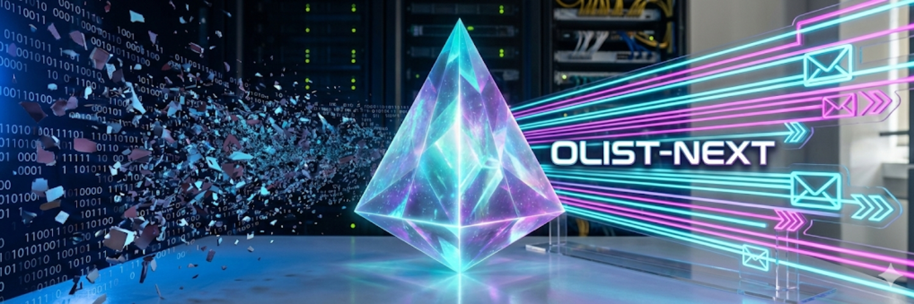
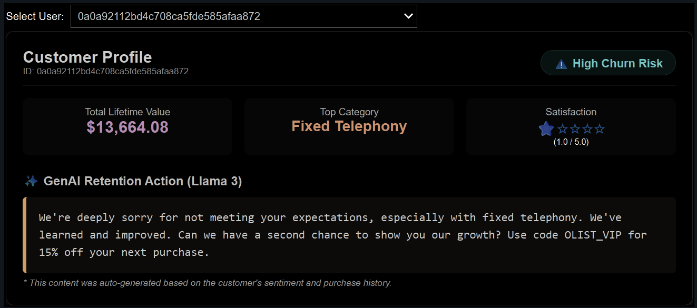
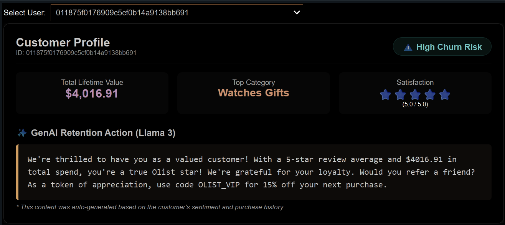
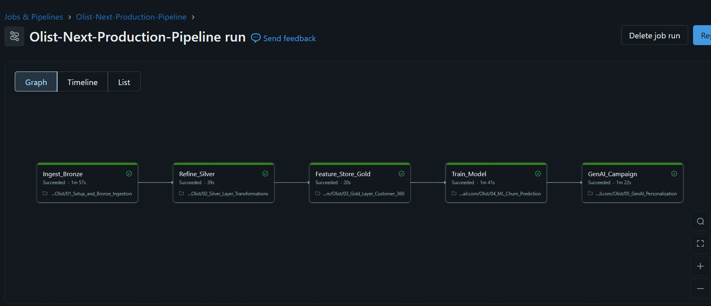

<div align="center">

# Olist-Next: Hyper-Personalized Retention Engine 🚀
### *Turning One-Time Buyers into Loyal Customers with Lakehouse & GenAI*

[](https://databricks.com/)
[](https://www.python.org/)
[](https://spark.apache.org/docs/latest/)
[](https://mlflow.org/docs/latest/)
[](https://www.llama.com/models/llama-3/)

[](https://www.linkedin.com/in/grandmastertanmay/)

</div>

---

## 📋 Executive Summary

**Olist-Next** is a closed-loop retention system designed to solve the E-Commerce "One-Time Buyer" problem. By leveraging the **Databricks Lakehouse Platform**, this project ingests raw transactional data, identifies at-risk customers using **XGBoost**, and automatically generates hyper-personalized retention emails using **Llama 3 (GenAI)**. It transforms passive data storage into active revenue generation.

---

## 🌟 Key Features

1. 🛡️ **Unity Catalog Governance**  
   **Problem:** Data swamps where schemas break and permissions are loose.  
   **Solution:** Full governance using Unity Catalog (`olist_hackathon` catalog).  
   **Tech:** Managed Volumes for raw data, Auto Loader with Schema Evolution.

2. 🔮 **Predictive Modeling (MLflow)**  
   **Problem:** Blindly sending discounts to everyone destroys margins.  
   **Solution:** Targeted Churn Prediction using Random Forest.  
   **Tech:** `pyspark.ml` pipelines tracked via MLflow (Metrics: AUC 0.60+, F1 0.71).  
   **Innovation:** Strict leakage prevention by excluding recency features.

3. 🪄 **GenAI Personalization (Llama 3)**  
   **Problem:** Generic "We Miss You" emails get deleted.  
   **Solution:** Context-aware generation.  
   Unhappy Customer (Low Score)? $\rightarrow$ Apologetic Tone.  
   Happy Customer (High Score)? $\rightarrow$ Referral Request.  
   **Tech:** `databricks-meta-llama-3-3-70b-instruct` via MLflow Deployments API.

---

##   

## 📂 Project Structure

This project is organized into five sequential notebooks, mirroring the data flow from ingestion to action.

| Notebook | Description | Key Tech |
| :--- | :--- | :--- |
| **01_Setup_Ingest** | Configures the Unity Catalog environment and uses **Auto Loader** to ingest raw CSVs into the Bronze layer. Handles schema inference and "rescued data" automatically. | `Auto Loader`, `Volumes` |
| **02_Silver_Layer** | Cleanses data by standardizing timestamps, filtering for completed orders, and translating product categories from Portuguese to English. | `Delta Lake`, `PySpark` |
| **03_Gold_Features** | Aggregates the relational data into a flat **"Customer 360"** table. Calculates RFM (Recency, Frequency, Monetary) metrics and sentiment scores for ML modeling. | `Feature Engineering`, `SQL` |
| **04_ML_Training** | Trains an **XGBoost** classifier to predict customer churn. Uses **MLflow** to track experiments, log metrics (F1-score, AUC), and register the best model to the Unity Catalog. | `XGBoost`, `MLflow` |
| **05_GenAI_Action** | The "Action" layer. Identifies high-probability churners and uses **Llama 3** (via Foundation Model APIs) to generate hyper-personalized retention emails based on their specific review history. | `GenAI`, `Llama 3` |
| **06_Live_Demo_App** | A **Live CRM Dashboard** built with `ipywidgets`. Allows users to interactively select at-risk customers and generate retention emails in real-time. | `ipywidgets`, `Dashboard` |

---

## 🖥️ Interactive Demo: The Retention CRM

**"Code is good, but a working product is better."**

The `06_Live_Demo_App` notebook is not just a script—it is a fully functional **Interactive CRM Portal** built directly within Databricks using `ipywidgets`. It serves as the "Proof of Functionality" for the entire pipeline, demonstrating how the backend data engineering and AI models translate into a real-world tool for Customer Success Managers.

1-⭐ Customer

5-⭐⭐⭐⭐⭐ Customer


### 🎮 What You Can Do
This dashboard mimics a production environment where a retention specialist can:
1.  **Simulate Risk Detection:** Instantly filter the database for high-value customers flagged as "At-Risk" by the XGBoost model.
2.  **View Customer 360:** See a live snapshot of the customer's profile, including total spend, favorite category, and their most recent (negative) review.
3.  **Generate AI Responses:** Watch **Llama 3** generate a hyper-personalized retention email in real-time, referencing specific details from the customer's history.

### 🚀 How to Use
To experience the demo:
1.  Open the `06_Live_Demo_App` notebook.
2.  Click **"Run All"** to load the widgets and model inference.
3.  **Select a Customer ID** from the dropdown menu.
4.  The dashboard will automatically populate with the customer's risk profile and the generated email draft.

---

## ⚙️ Production Orchestration

To transition from ad-hoc analysis to a production-grade system, the entire Olist-Next pipeline is automated using **Databricks Workflows (Jobs)**. This moves the project beyond isolated notebooks into a resilient, scheduled data product.

The orchestration is managed as a multi-task Directed Acyclic Graph (DAG), ensuring that data flows linearly from raw ingestion to GenAI action with strict integrity checks.

### The Workflow DAG
Below is the actual execution DAG utilized for weekly retention cycles.


*Figure 1: The multi-task orchestration DAG in the Databricks Jobs UI, showing successful linear execution.*

### Key Orchestration Features

* **🔗 Linear Task Dependencies:** The workflow enforces a strict dependency chain (`01_Ingest`-> `02_Silver` -> `03_Gold` -> `04_ML_Train` -> `05_GenAI_Action`). Downstream tasks **only** initiate if the upstream predecessor completes successfully, preventing data corruption or model training on incomplete datasets.
* **🛠️ Parameterized Execution:** The job accepts run-time parameters (e.g., `widget_env = "prod"`), allowing the same codebase to behave differently in development versus production environments without manual code changes.
* **📅 Automated Scheduling:** The pipeline is scheduled to run automatically on a weekly cadence (e.g., every Monday morning) to capture the latest weekend transaction data and generate fresh retention emails for the new week.

---

## 💰 Business Impact (ROI)

The "Olist-Next" engine moves beyond passive reporting to active revenue protection. By automating the retention process, we can estimate the Return on Investment (ROI) based on Olist's historical averages.

* **The Scenario:** A weekly campaign targeting **1,000** high-value, at-risk customers.
* **The Lift:** Moving from a generic email (2% conversion) to a hyper-personalized GenAI email (5% conversion).
* **The Value:**
    > **50 Retained Customers** (5% of 1k) × **$150 Average Order Value**
    >
    > **= $7,500 Saved per Campaign Run** 💸

*Scalability:* Running this weekly could potentially save **~$300,000 annually** by reducing churn in high-value segments.

---

## 🚀 How to Run

Follow these steps to deploy the project in your own Databricks environment.

### 1. Prerequisites
* A Databricks Workspace (Community Edition or Premium).
* Access to Databricks Foundation Model APIs (for the GenAI component).

### 2. Setup
1.  **Clone the Repository:**
    ```bash
    git clone [https://github.com/grandmastertanmay/Databricks-14-Days-AI-Challenge](https://github.com/grandmastertanmay/Databricks-14-Days-AI-Challenge)
    ```
2.  **Get the Data:**
    * Download the **[Brazilian E-Commerce Public Dataset](https://www.kaggle.com/datasets/olistbr/brazilian-ecommerce)** from Kaggle.
    * Upload the 9 CSV files to a Databricks Volume or DBFS path.

### 3. Execution
1.  Import the `.dbc` archive or individual notebooks into your Workspace.
2.  Open `01_Setup_Ingest` and update the `volume_path` variable to point to your uploaded data.
3.  Run the notebooks in order (01 through 05).

---

## 🙏 Acknowledgments

This project was built during the **Databricks 14-Days of AI Challenge**. A massive thank you to the organizers and sponsors for fostering this community of learning.

* **Organized By:** [Indian Data Club (IDC)](https://www.linkedin.com/company/indian-data-club/)
* **Sponsored By:** [Databricks](https://databricks.com/) & [Codebasics](https://codebasics.io/)
* **Dataset:** [Olist Store](https://www.kaggle.com/olistbr) (via Kaggle)

---
*If you find this project helpful, please give it a ⭐ on GitHub!*